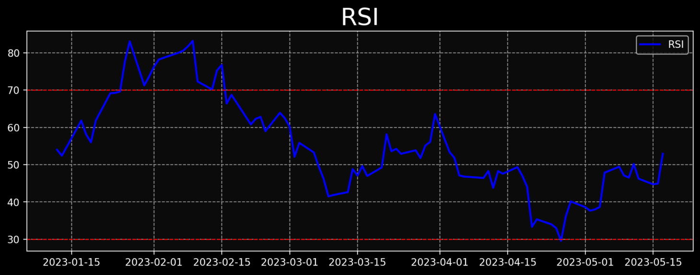

# Interactive Stock Market Dashboard with Python
---
# Team Members:
---
 - **Kousik Dhanekula** *(kousikdh@buffalo.edu)* 
 - **Mohana Shiva Sai Yashodhar** *(mohanasi@buffalo.edu)*
 - **Satish Varma Bupathiraju** *(satishva@buffalo.edu)*
 - **Vamshi Krishna Sundalam** *(vsundala@buffalo.edu)*

---
## Task List
*The table below will serve as your Progress Report (due by end of day on Monday, May 8).  Be sure to list all tasks that you need to complete to finish your analysis and to successfully complete the requirements of this project.*

| ID | Task Description | Due Date | Status |
| --- | --- | --- | --- |
| 1 | Identifying all required dependencies |2023-04-24 | DONE |
| 2 | Understand how aplphavintage API works |2023-04-27| DONE |
| 3 | Building a Pandas Dataframe with the retrieved data |2023-04-28 | DONE |
| 4 | Creating Candlesticks chart for the stock data using mplfinance |2023-04-30 | DONE |
| 5 | Understanding how streamlit works|2023-04-30| DONE |
| 5 | Adding moving average indicator to our chart|2023-05-06| DONE |
| 6 | Adding MACD indicator to the chart |2023-05-07| DONE |
| 7 | Making userfriendly interface using srteamlit|2023-05-12| In Progress |
| 8 | Adding streamlit to our code|2023-05-14| NOT DONE |
| 9 | Deploying web application|2023-05-15| NOT DONE |
| 10 | Complete YouTube video and upload to YouTube | 2023-05-16 | NOT DONE |
| 11 | Upload README.md document to Github | 2023-05-17 |NOT DONE|

--- 

# Introduction

## Purpose of the Project

Since we all have a curiosity about cryptocurrency, we chose to pursue this topic. Cryptocurrency is becoming increasingly popular and prevalent therefore, it can be beneficial to have a better understanding of it. It can be difficult for traders to find suitable visualizations for real-time cryptocurrency data. Our project aims to address that challenge by creating an easy-to-use, interactive tool that provides traders with insightful visualizations of market trends and patterns. That way, even novice and less experienced traders can use these visualizations too. By leveraging real-time data, our project will provide traders with the most up-to-date information, helping them make more informed trading decisions. Ultimately, this project aims to contribute to the rapidly growing field of cryptocurrency trading and help traders navigate this complex and dynamic market.

## Type of Data Using and what we want to do with it

The chosen data source, bitstamp.net, will enable us to conduct this analysis by providing real-time data on different cryptocurrencies. The data provided by bitstamp.net is reliable and accurate, and it covers a wide range of cryptocurrencies. It provides data in real time so we can see the most up-to-date trends, for various cryptocurrencies. **Columns of our data: time stamp, closing price, highs, lows, and volume** all of which are very crucial for this project. From this data, we will be able to perform all of the analysis we intend on doing. Overall, the chosen source data is well-suited for the analysis plan outlined in the project description above.

## Data Analysis
   1. Import the data from bitstamp.net via GET and turn it into a Panda dataframe
   
   2. Change the time stamp to Date and Time to use it for visualization and also for the interactive time step for the trends
   
   3. Create an HTML webpage to display the visualizations
   
   4. Integrate the Plotly Dash library to create the visualizations
   
   5. Add controls such as dropdown and scrollbar to allow users to make changes to the type of cryptocurrency or the time step used to display the plots
   
   6. Make the interface more user friendly

---

## References
- Alpha Vantage  [https://www.alphavantage.co/documentation/]
- mplfinance [ https://pypi.org/project/mplfinance/]
- Streamlit [ https://docs.streamlit.io/library/api-reference]
- TA-Lib : Technical Analysis Library [ https://ta-lib.org/]


---

## Requirements
- *pandas*
- *mplfinance*
- *matplotlib*
- *numpy* 
- *streamlit*
- *Alpha Vantage API*
- *TA-Lib *
---
## Explanation of the Code

The code, `main.py`, begins by importing necessary Python packages:
```
pip install streamlit requests pandas mplfinance matplotlib ta

```
### Import required packages and libraries**
```python
from dash import Dash, dcc, html, Input, Output
import dash_bootstrap_components as dbc
import plotly.express as px
import plotly.graph_objects as go
import pandas as pd
import numpy as np
import pandas_ta as ta
import requests
```
### Adding bootstrap themes
Bootstrap themes generate the display and style of a website. There are various bootstrap themes available, thus providing options for website layout and design. In order to add them to the web applications, this portion of code needs to be executed. This project is currently using the bootstrap theme of CYBORG. If a user wants to have a different website aesthetic, they would need to change CYBORG to whatever bootstrap theme is desired. 
```python
app= Dash(external_stylesheets = [dbc.themes.CYBORG])
```

### Designing the dropdowns 
Since there are many different types of cryptocurrencies, a dropdown needed to be generated so that users can choose what specific cryptocurrency they want to see the trends for. Additionally, the dropdowns are used so users can determine what specific features they want displayed. In order to have these various dropdowns, the portion of code below would need to be run.
```python
def create_dropdown(option, id_value):

    return html.Div(
            [
                html.H2(" ".join(id_value.replace("-"," ").split(" ")[:-1]),
                    style={"padding":"10px 10px 10px 20px"}),    
                dcc.Dropdown(option,id=id_value, value=option[0])
                ],style={"padding":"0px 20px 0px 30px"}
        )   

```

### Layout of the web application
From this section of code, the website gets its visual layout. For example, as shown in the code below, the order of the dropdowns is: cryptocurrency type, timeframe (in milliseconds), number of candles, Bollinger, and Fibonacci. These elements are on the left side of the webpage. The order in which they appear can be modified by changing this part of the code. 

```python
app.layout = html.Div([
                    
                        html.Div([
                                    html.H1("Crypto Currency Dashboard",style={"text-align-last": "center", "font-variant-caps": "small-caps","padding":"20px 20px 30px 30px"})

                        ]),
                        

                        html.Div([
                            html.Div([
                                    html.Div([
                                    create_dropdown(["btcusd","ethusd","xrpusd","ltcusd","gbpusd","eurusd","bchusd","paxusd","dogeusd"],"Currency-select"),
                                    create_dropdown(["259200", "86400", "43200", "21600", "14400", "7200", "3600", "1800", "900", "300", "180"],"Timeframe-select"),
                                    create_dropdown(["200","150","100","50","20"],"Candles-select"),
                                    create_dropdown(["Off","On"],"Bollinger-select"),
                                    create_dropdown(["Off","On"],"Fibonacci-select"),
                                    
                                ], style={"display":"table-row","margin":"auto", "width":"800px","justify-content":"space-around"}),

                                    
                                    
                                    ]), 
                            html.Div([

                            dcc.Graph(id="candlesticks"),
                            dcc.Graph(id="indicator"),
                            

                            
                            
                            ],style={"display":"flex","flex-direction":"column","width":"900px"}),

                        
                        ],style={"display":"flex","flex-direction":"row"})


                        ],style={"display":"flex","flex-direction":"column"})

```
### Application callbacks 
This part of the code handles the user's inputs and outputs. For things such as Timeframe, Currency, Candles, Bollinger, Fibonacci, users must provide an input by selecting the specific value they want displayed. The outputs are for the candlesticks and indicator elements which end up provding a figure, not a value. This code is what enables the webpage to update based on the user's interactions with the application.  
```python
@app.callback(
        Output("candlesticks","figure"),
        Output("indicator","figure"),
        Input("Currency-select","value"),
        Input("Timeframe-select","value"),
        Input("Candles-select","value"),
        Input("Bollinger-select","value"),
        Input("Fibonacci-select","value"),
        
        
)
```
### Update figure function 
The function below provides the updated output for the candlesticks and RSI. These updates then contribute to the Application's layout. 
```python
def update_figure(Currency, timeframe, candles,bands,lines):
   
    #API #Requires the name of the currency to be added into it to get the data
    url=f"https://www.bitstamp.net/api/v2/ohlc/{Currency}/"
    
    #Api parameters
    params = {
        "step":timeframe,
        "limit":int(candles)+14,
            }
    

    data = requests.get(url, params=params).json()["data"]["ohlc"]
    data= pd.DataFrame(data) #Pandas dataframe with OHLC data 
    data.timestamp = pd.to_datetime(pd.to_numeric(data.timestamp), unit='s')
    data["rsi"] = ta.rsi(data.close.astype(float)) #data for the RSI
    
    

    data= data.iloc[14:]

    

    # Compute Bollinger Bands
    rolling_mean = data['close'].rolling(window=20).mean()
    rolling_std = data['close'].rolling(window=20).std()
    upper_band = rolling_mean + 2 * rolling_std
    lower_band = rolling_mean - 2 * rolling_std

    # Compute Fibonacci retracement levels
    max_price = data["high"].max()
    min_price = data["low"].min()
    diff = float(max_price) - float(min_price)
    levels = [float(max_price),float(max_price) - (0.236 * diff), float(max_price) - (0.382 * diff), float(max_price) - (0.5 * diff),
              float(max_price) - (0.618 * diff), float(max_price) - (0.786 * diff),float(max_price) - (0.886 * diff), float(min_price)]
    
    # Create the Candlestick trace
    candlesticks_trace = go.Candlestick(
        x=data.timestamp,
        open=data.open,
        high=data.high,
        low=data.low,
        close=data.close,
        
    )
    
    # Create the Bollinger Bands traces
    upper_band_trace = go.Scatter(
        x=data.timestamp,
        y=upper_band,
        name='Upper Bollinger Band',
        visible=True if bands == "On" else False
        
    )
    
    lower_band_trace = go.Scatter(
        x=data.timestamp,
        y=lower_band,
        name='Lower Bollinger Band',
        visible=True if bands == "On" else False
    )
    #Create Fibonacci level traces
    level_traces = []
    for i, level in enumerate(levels):
        level_trace = go.Scatter(
            x=data.timestamp,
            y=np.repeat(level, len(data)),
            name=f"Level {i+1}",
            visible=True if lines == "On" else False,
            line_color=f"rgb(255, {(i+1)*40}, 0)"
        )
        level_traces.append(level_trace)


    # Update the figure with the new traces
    candlesticks = go.Figure(data=[candlesticks_trace, upper_band_trace, lower_band_trace]+level_traces)
    


    #Modifying how the Candlesticks plot and RSI plot looks like
    candlesticks.update_layout(xaxis_rangeslider_visible=False,height=400, template="plotly_dark",title=f"{Currency.upper()} Candlesticks with Bollinger bands and Fibonacci Retracement Levels")
    indicator = px.line(x=data.timestamp,y=data.rsi , height = 300, template="plotly_dark", labels={ "x": "DateTime", "y":"RSI"}, title="Relative Strength Index")
    

    return candlesticks, indicator


if __name__== '__main__':
    app.run_server(debug=True,)
```
---

## How to Run the Code

>1. Open Anaconda Navigator's Command Terminal

>2. Change to the directory where you have the python code file (```main.py``` in this case)

>3. Create a Virual environment (let's say) ```myenv```- Type in the terminal ```python3 -m venv myenv``` This will create a virual environment in that directory

>4. Now change the directory to ```myenv``` and type ```scripts\activate.bat``` in the terminal for windows and ```source myenv/bin/activate``` for mac

>4. Now pip install the required packages here ```Dash, Plotly, dash_bootstrap_components, requests, pandas_ta```

>5. After the packages are installed, Run the python file ```python3 main.py```

>6. This will give you prompt ```Dash is running on http://127.0.0.1:8050/```

>7. After getting the prompt hold the CTRL key and click on the link, This will open the web application on your default browser

---

## Results from your Analysis

**The Dashboard of the web application looks like:**


**The Candlestick plot with Bollinger Bands**
 provide information about price volatility and potential price reversals. The bands consist of a moving average with an upper and lower band representing standard deviations. When the price moves near the bands, it suggests potential overbought or oversold conditions and possible trend changes.


**The Candlestick plot with Fibonacci levels**
 help identify potential support and resistance levels based on Fibonacci ratios. These levels indicate potential areas where price may reverse or consolidate, based on the Fibonacci sequence. Traders often use these levels to determine potential entry or exit points in a trend.


**The Relative Strength Index plot**
 provides information about the strength and momentum of a price trend. It is a technical indicator that measures the speed and change of price movements. RSI values range from 0 to 100, with readings above 70 indicating overbought conditions and readings below 30 suggesting oversold conditions.

