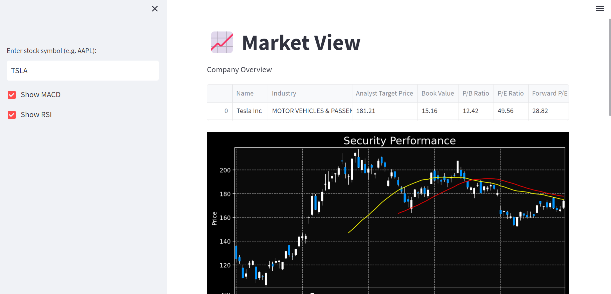
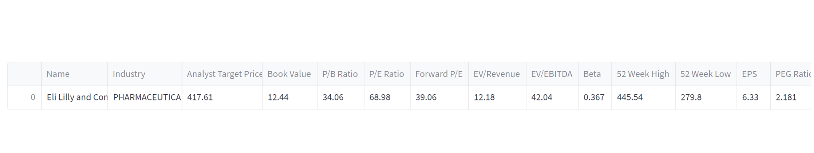
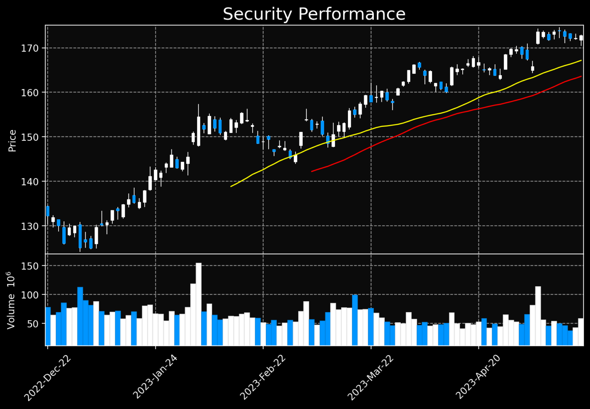
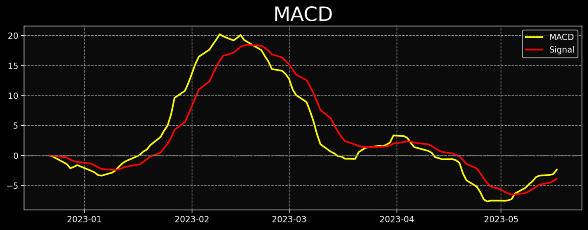
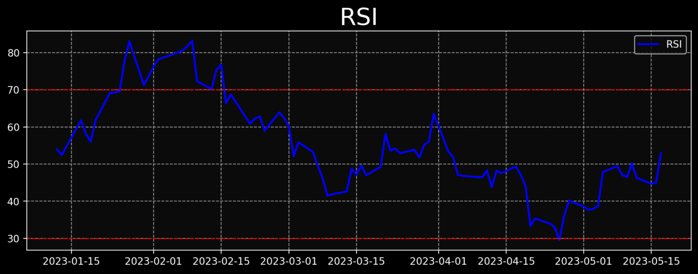
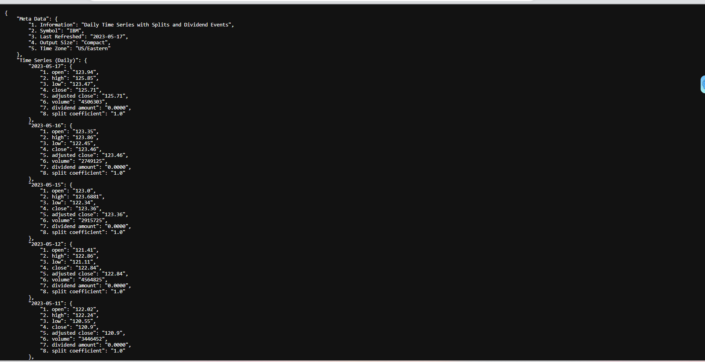
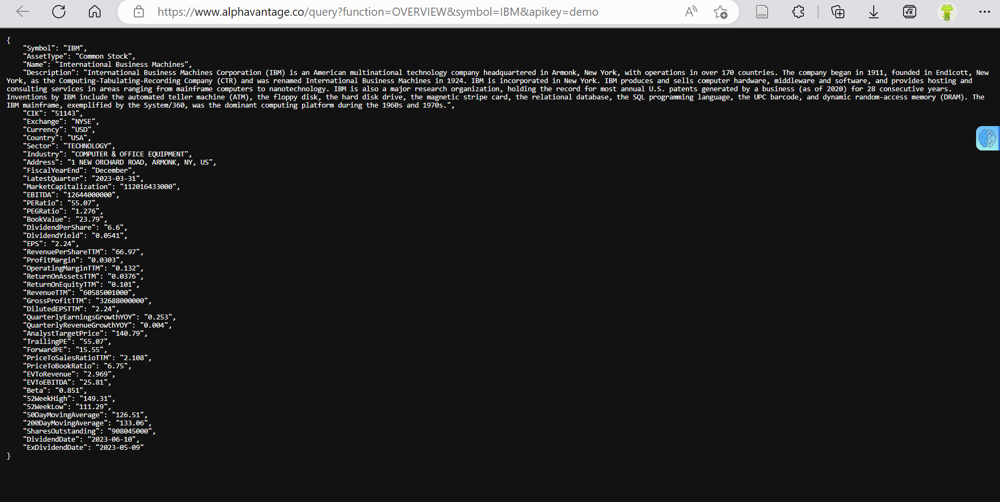

#  Market View: Navigating Stocks with Confidence and Clarity.
---
# Author: 
 - **Mohana Shiva Sai Yashodhar Golleru** *(mohanasi@buffalo.edu)* 

## Aim of the Project

Our Data applications provide users with a user-friendly tool for accessing and analyzing stock market data. The project aims to achieve the following:
 >1.Data Retrieval: Retrieve daily stock price data and company overview information from the Alpha Vantage API.

 >2.Visualization: Display stock price data using candlestick charts and provide options to visualize technical indicators like MACD and RSI.

 >3.Technical Analysis: Calculate technical indicators such as MACD and RSI to identify trends, momentum, and potential buying/selling opportunities.

 >4.User-Friendly Interface: Create an intuitive interface using Streamlit, allowing users to enter stock symbols, explore data, and customize their analysis.

Overall, the Market View Application aims to empower users by providing access to stock market data, facilitating technical analysis, and enabling informed decision-making based on visualized data and fundamental company metrics.

---

## References
- Alpha Vantage  [https://www.alphavantage.co/documentation/]
- mplfinance [ https://pypi.org/project/mplfinance/]
- Streamlit [ https://docs.streamlit.io/library/api-reference]
- TA-Lib : Technical Analysis Library [ https://ta-lib.org/]

---
## The Dashboard of the web application looks like


**Company Overview:**



**Stock Price Chart:**

The application displays a candlestick chart of the stock's performance. It shows the opening, closing, highest, and lowest prices for each day. Additionally, it includes moving averages (MA) of 35 and 50 periods and volume bars.
 


**MACD Indicator:**





**The Relative Strength Index Indicator:**




---
## Explanation of the Code

Let's begin by installing necessary Python packages:
```
pip install streamlit requests pandas mplfinance matplotlib ta
```
### Import required packages and libraries
```python
import streamlit as st
import requests
import pandas as pd
import mplfinance as mpf
import matplotlib.pyplot as plt
import ta
```
### Defining a function to get stock data: 

```python
def get_stock_data(symbol, exchange):
    # Get daily stock price data
    url = f"https://www.alphavantage.co/query?function=TIME_SERIES_DAILY_ADJUSTED&symbol={symbol}&outputsize=compact&apikey={API_KEY}"
    if exchange:
        url += f"&market={exchange}"
    response = requests.get(url)
    data = response.json()["Time Series (Daily)"]
    X = pd.DataFrame.from_dict(data, orient="index")
    X.index = pd.to_datetime(X.index)
    X = X.astype(float)
    X = X.drop(columns=["7. dividend amount","8. split coefficient"])
    df = X.rename(columns={'1. open':'Open','2. high':'High','3. low':'Low','4. close':'Close','5. adjusted close':'Adj Close','6. volume': 'Volume'})
    df = df.sort_index(ascending=True) # Sort dataframe by date in ascending order
    
```
### Example of JSON Output 



### Defining a function to get company overview data:
```python
    url = f"https://www.alphavantage.co/query?function=OVERVIEW&symbol={symbol}&apikey={API_KEY}"
    response = requests.get(url)
    data = response.json()
    company_name = data.get('Name')
    industry = data.get('Industry')
    ebitda = data.get('EBITDA')
    pe_ratio = data.get('PERatio')
    pb_ratio = data.get('PriceToBookRatio')
    book_value = data.get('BookValue')
    ev_to_revenue = data.get('EVToRevenue')
    ev_to_ebitda = data.get('EVToEBITDA')
    beta = data.get('Beta')
    eps = data.get('EPS')
    peg_ratio = data.get('PEGRatio')
    forward_pe = data.get('ForwardPE')
    analyst_target_price = data.get('AnalystTargetPrice')
    high_52_weeks = data.get('52WeekHigh')
    low_52_weeks = data.get('52WeekLow')
    
    company_overview_data = {'Name':[company_name],'Industry': [industry],'Analyst Target Price': [analyst_target_price],
                             'Book Value': [book_value],'P/B Ratio': [pb_ratio], 'P/E Ratio': [pe_ratio], 
                             'Forward P/E': [forward_pe], 'EV/Revenue': [ev_to_revenue], 
                             'EV/EBITDA': [ev_to_ebitda], 'Beta': [beta], '52 Week High': [high_52_weeks], 
                             '52 Week Low': [low_52_weeks],'EPS': [eps], 'PEG Ratio': [peg_ratio]}
```
### Example of JSON Output:



### Display the company overview data as a table:

```python
    st.write('Company Overview')
    st.dataframe(pd.DataFrame.from_dict(company_overview_data).iloc[:20, :20])
```

### Define the Streamlit app:

```python
def main():
    st.set_page_config(page_title="Market View", page_icon=":chart_with_upwards_trend:", layout="wide", initial_sidebar_state="collapsed")
    st.title(":chart_with_upwards_trend: Market View")

    # Ask user to input stock symbol
    symbol = st.sidebar.text_input("Enter stock symbol (e.g. AAPL):", key="symbol_input")
    if not symbol:
        st.warning("Please enter a stock symbol in the search bar present towards the left to continue")
        return
```
### Call the get_stock_data function:

```python
    df = get_stock_data(symbol, 'NASDAQ')
```
### Calculating the MACD:
```python
    exp1 = df['Close'].ewm(span=12, adjust=False).mean()
    exp2 = df['Close'].ewm(span=26, adjust=False).mean()
    macd = exp1 - exp2
    signal = macd.ewm(span=9, adjust=False).mean()
```
### Calculating the RSI
```python
    df['RSI'] = ta.momentum.RSIIndicator(df['Close']).rsi()
```
### Add checkboxes for MACD and RSI

```python
    show_macd = st.sidebar.checkbox("Show MACD", value=True)
    show_rsi = st.sidebar.checkbox("Show RSI", value=True)
```
### Create the stock price chart using mplfinance
```python
    fig_stock, ax_stock = mpf.plot(df, type='candle', mav=(35, 50), volume=True, tight_layout=True,
                                   style='nightclouds', figratio=(20, 12), figscale=0.95,
                                   returnfig=True, mavcolors=('yellow', 'red'))
```

### Display the stock price chart

```python 
    ax_stock[0].set_title("Security Performance", fontsize=18)  # Increase the title fontsize
    st.pyplot(fig_stock)
```

### Create the MACD plot if checkbox is selected
```python
    if show_macd:
        fig_macd, ax_macd = plt.subplots(figsize=(12, 4))
        ax_macd.plot(macd, color='yellow', linewidth=2, label='MACD')
        ax_macd.plot(signal, color='red', linewidth=2, label='Signal')
        ax_macd.axhline(0, color='gray', linestyle='--')
        ax_macd.legend()
        ax_macd.set_title("MACD", fontsize=24) 
        st.pyplot(fig_macd)
```

### Create the RSI plot if checkbox is selected

```python
    if show_rsi:
        fig_rsi, ax_rsi = plt.subplots(figsize=(12, 4))
        ax_rsi.plot(df['RSI'], color='blue', linewidth=2, label='RSI')
        ax_rsi.axhline(30, color='red', linestyle='--', alpha=1)
        ax_rsi.axhline(70, color='red', linestyle='--', alpha=1)
        ax_rsi.legend()
        ax_rsi.set_title("RSI", fontsize=24)  # Increase the title fontsize
        st.pyplot(fig_rsi)
```
---

## How to Run the Code

>1. Open Anaconda Navigator's Command Terminal

>2. Change to the directory where you have the Python code file (```StockAPP.py``` in this case). You can use the cd command to navigate to the directory:```cd path/to/directory```

>3. Create a virtual environment. You can use the ```venv``` module to create a virtual environment. Run the following command in the terminal: ```python -m venv myenv```

>4. Activate the virtual environment. The activation command varies depending on the operating system.For Windows:```myenv\Scripts\activate``` and For macOS/Linux:```source myenv/bin/activate```

>4. Install the required libraries. You can use pip to install them: ```pip install streamlit requests pandas mplfinance matplotlib ta```

>5. After the packages are installed, Run the Streamlit app by executing the following command: ```streamlit run StockAPP.py```

>6. This will start the Streamlit development server and provide a local URL. Look for a line in the terminal that says:```You can now view your Streamlit app in your browser.Local URL: http://localhost:8501 Network URL: http://10.84.101.87:8501```

>7. After getting the prompt hold the CTRL key and click on the link, This will open the web application on your default browser

>8. You should see the Streamlit app interface in your web browser. Enter a stock symbol in the sidebar text input and click "Enter" or press "Return" on your keyboard

Note: Make sure you have a stable internet connection to access the Alpha Vantage API and retrieve the stock data. Also, ensure that the provided Alpha Vantage API key is valid and active.

---


